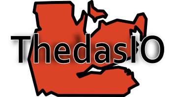
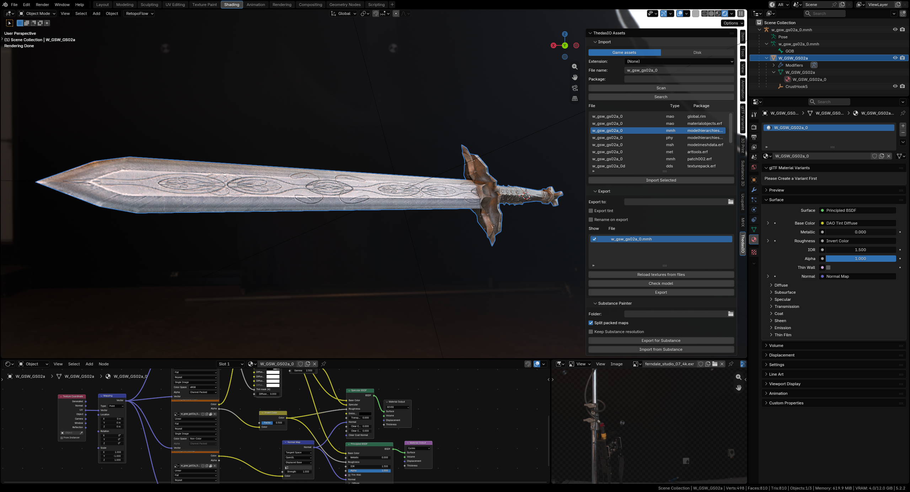

  

# Overview

**ThedasIO** is a Blender 5.2 extension that imports Dragon Age: Origins models (`.msh` meshes, `.mmh` hierarchies) with their textures, materials, armature and skin weights, and exports every loaded resource back out as standalone files. It provides an easy to use interface to easily unpack the supported files directly from the installation files.

## What it does

- **Import** from the game's asset database (scans `.rim`/`.erf` packages) or from a file on disk. Pulls in the sibling `.msh`, `.mao` and textures automatically (this functionality works only for `.mmh` files).
- **Materials** are rebuilt from the MAO's channel packing into a Specular BSDF, with a "DAO Tint" node
  group per side driven by `.tnt` values.
- **Editing** works normally in the viewport: pose bones, vertex weights, UVs, textures. Textures are unpacked to a `thedas_io_textures/` folder beside the `.blend`, so they can be edited in an external program and reloaded.
- **Export** writes each loaded resource to a folder you pick. Untouched files come out byte-identical to the source; edited ones are re-encoded.

## How do I do anything

Documentation about the usage from the modder's perspective is available in [docs/modders/index.md](docs/modders/index.md).

## Install

Drag and drop generated package from the [Releases](https://github.com/Reyuu/ThedasIO/releases) page onto your Blender.

If you encounter problems with installation, be sure to check [Blender's documentation](https://docs.blender.org/manual/en/latest/editors/preferences/extensions.html) about extensions first before creating an issue.

## TODO
- loading DLC `.rim` and `.erf` files from `.dazip`

## Contributing

See [CONTRIBUTING.md](docs/CONTRIBUTING.md) for more information.

## Development

See [DEV_WORKFLOW.md](docs/DEV_WORKFLOW.md) for more information.
